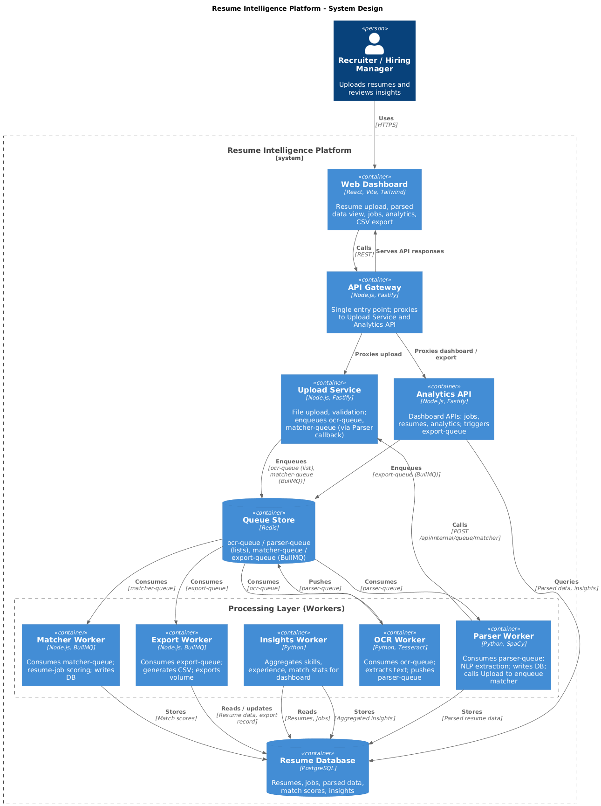
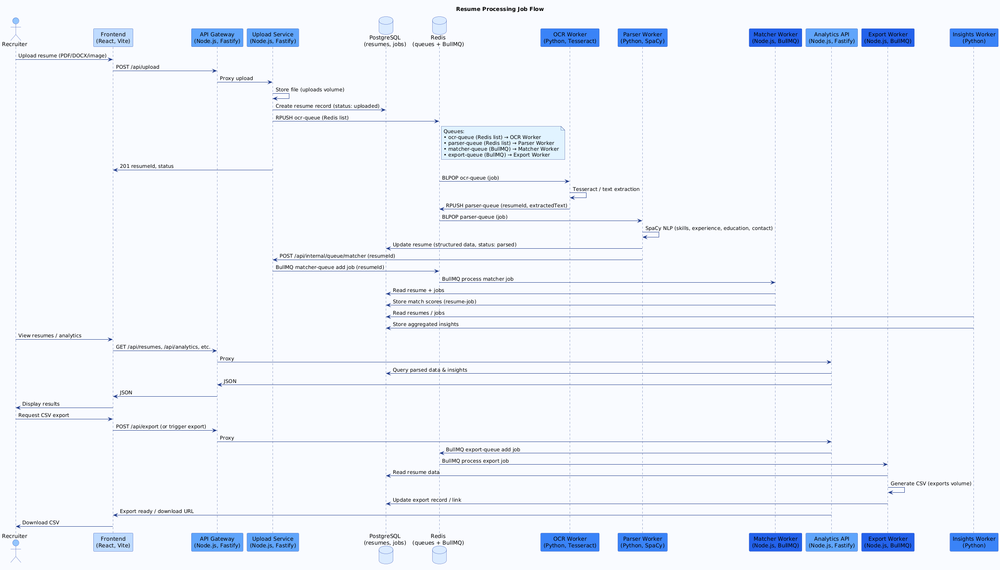

# Resume Intelligence Platform

An automated, scalable resume parsing and analytics platform that processes resumes, extracts key information, matches candidates to job roles, and provides actionable insights on it.

## Features

- **Multi-format upload** — PDF, DOCX, and image formats
- **OCR processing** — Text extraction from scanned documents (Tesseract)
- **NLP extraction** — Skills, experience, education, contact info
- **Role matching** — Resume-to-job matching with scoring
- **Analytics dashboard** — Skills, experience, education, match insights
- **CSV export** — Export parsed resume data
- **Scalable architecture** — Queue-based microservices, Docker Swarm
- **Load testing** — k6 for capacity planning

## System design

High-level architecture of the Resume Intelligence Platform:



Resume processing job flow (upload → OCR → parser → matcher → dashboard and export):



**Detailed documentation:**

- **[Architecture](docs/architecture/README.md)** — Components, data flow, queues, deployment
- **[Runbooks](docs/runbooks/README.md)** — Operations, incident response, troubleshooting

---

## Tech Stack

| Layer      | Technology                                    |
| ---------- | --------------------------------------------- |
| Frontend   | React, TypeScript, Vite, Tailwind, ApexCharts |
| API        | Node.js, TypeScript, Fastify                  |
| Queue      | BullMQ (Redis)                                |
| OCR        | Tesseract (Python)                            |
| Parser/NLP | Python (SpaCy) / Node.js                      |
| Database   | PostgreSQL                                    |
| Monorepo   | Turborepo, pnpm                               |
| Deployment | Docker, Docker Compose, Docker Swarm          |

---

## Security (API servers)

All Node.js APIs (API Gateway, Upload Service, Analytics API) use industry-standard security:

- **Helmet** — HTTP security headers: HSTS, X-Content-Type-Options (noSniff), X-Frame-Options, Referrer-Policy, Cross-Origin-Resource-Policy, permitted cross-domain policies, etc.
- **Rate limiting** — Per-IP limits (configurable via `RATE_LIMIT_MAX`, `RATE_LIMIT_WINDOW`). Gateway default: 10000/15min; Upload: 500/15min; Analytics: 1000/15min.
- **CORS** — Allowed methods and headers restricted; credentials supported where needed.

Tune limits per environment (e.g. higher for load tests, lower for public APIs).

---

## Project Structure

```
resume-intelligence-platform/
├── apps/                          # Deployable applications
│   ├── api-gateway-node/          # API gateway (entry point, proxies)
│   ├── upload-service-node/       # File upload, queue OCR/parser jobs
│   ├── analytics-api-node/       # Dashboard, jobs, resumes, export APIs
│   ├── matcher-worker-node/       # BullMQ worker: resume–job matching
│   ├── export-worker-node/       # BullMQ worker: CSV export
│   ├── ocr-worker-python/        # OCR text extraction (Redis list)
│   ├── parser-worker-python/     # Resume parsing (Redis list)
│   ├── insights-worker-python/  # Insights aggregation (Redis list)
│   └── frontend-dashboard/       # React SPA
├── packages/                     # Shared libraries
│   ├── config/                   # Shared config (env, ports)
│   ├── logger/                   # Shared logger
│   ├── queue-lib/                # BullMQ producers/consumers
│   ├── resume-nlp/               # NLP utilities (Node)
│   └── role-matching/            # Matching/scoring logic
├── infra/                        # Infrastructure config (see infra/README.md)
│   ├── docker-compose/           # Compose files (dev, prod, microservices)
│   ├── swarm/                    # Docker Swarm stack
│   ├── ansible/                  # Server provisioning
│   ├── backup/                   # Backup scripts (Postgres, Redis)
│   ├── docker/                   # Monitoring stack (Prometheus, Grafana, Loki)
│   ├── health-checks/            # Health check script
│   ├── monitoring/               # Prometheus, Grafana, Alertmanager
│   └── postgres/                 # Init SQL and migrations
├── docs/                         # Documentation
│   ├── architecture/             # Architecture (components, data flow, queues)
│   ├── runbooks/                 # Operations, incident response, troubleshooting
│   └── system-design/            # System design + processing flow diagrams
├── scripts/                      # Build, deploy, seed, migrate, stop-swarm
├── load-testing/                 # k6 configs
├── package.json                  # Root scripts, turbo
├── pnpm-workspace.yaml
└── turbo.json
```

---

## Prerequisites

- **Node.js** 18+
- **pnpm** 8+ — `npm install -g pnpm`
- **Docker** and **Docker Compose**
- **Python 3.9+** (optional, for local parser/OCR development)

---

## Setup

### 1. Clone and install

```bash
git clone <repo-url>
cd resume-intelligence-platform
pnpm install
```

### 2. Environment

```bash
cp .env.example .env
# Edit .env (DB, Redis, ports, etc.)
```

### 3. Build

```bash
pnpm build
```

---

## Startup

### Option A: Docker Compose (all microservices)

Start everything (PostgreSQL, Redis, gateway, APIs, workers, frontend):

```bash
# Use existing images
pnpm run docker:microservices

# Or build images then start
pnpm run docker:start:build

# Or use the script (with status/output)
pnpm run docker:start
./scripts/start-all-services.sh --build

# Full stack with monitoring (Prometheus, Grafana, Loki)
pnpm run docker:start:full
```

Direct Compose:

```bash
docker-compose -f infra/docker-compose/docker-compose.microservices.yml up -d
```

### Option B: Local development (infra in Docker)

1. Start only PostgreSQL and Redis:

```bash
pnpm run docker:dev
# Or: docker-compose -f infra/docker-compose/docker-compose.dev.yml up
```

2. Run apps locally (separate terminals):

```bash
pnpm --filter @resume-platform/api-gateway dev
pnpm --filter @resume-platform/upload-service dev
pnpm --filter @resume-platform/analytics-api dev
pnpm --filter @resume-platform/frontend-dashboard dev
# Workers: matcher-worker-node, ocr-worker-python, parser-worker-python, etc.
```

### Option C: Docker Swarm (production-style)

```bash
docker swarm init
pnpm run swarm:deploy
# Check: docker stack services resume-platform
```

Stop Swarm stack:

```bash
pnpm run swarm:stop
# Or: bash scripts/stop-swarm.sh
```

---

## Access

**Application (microservices stack):**

| Service        | URL                                                |
| -------------- | -------------------------------------------------- |
| Frontend       | http://localhost:80 (Compose) or :8080 (local dev) |
| API Gateway    | http://localhost:3000                              |
| Upload Service | http://localhost:3001                              |
| Analytics API  | http://localhost:3002                              |
| PostgreSQL     | localhost:5432                                     |
| Redis          | localhost:6379                                     |

**Monitoring (only when using `docker:start:full` or after `infra:start`):**

| Service      | URL                                 |
| ------------ | ----------------------------------- |
| Prometheus   | http://localhost:9090               |
| Grafana      | http://localhost:3030 (admin/admin) |
| Alertmanager | http://localhost:9093               |

Health: `curl http://localhost:3000/health`

---

## Start scripts compared

| Script                                                         | What it does                                                                                                                                                                      |
| -------------------------------------------------------------- | --------------------------------------------------------------------------------------------------------------------------------------------------------------------------------- |
| **`pnpm run docker:start`**                                    | Start microservices with **existing** images (no build). Uses `start-all-services.sh`.                                                                                            |
| **`pnpm run docker:start:build`**                              | **Build** images, then start **microservices only** (gateway, upload, analytics, workers, frontend, Postgres, Redis). No Prometheus/Grafana.                                      |
| **`pnpm run docker:start:full`**                               | **Build** images, start **microservices**, then start **monitoring stack** (Prometheus, Grafana, Loki, Promtail, Alertmanager). Use this to get Grafana at http://localhost:3030. |
| **`pnpm run docker:microservices`**                            | Start microservices with existing images (Compose only, no script).                                                                                                               |
| **`pnpm run swarm:deploy`** / **`pnpm run swarm:start:build`** | Deploy the **same apps** as **Docker Swarm** (production-style, replicas, single published port). No monitoring stack unless you add it separately.                               |
| **`pnpm run swarm:start`**                                     | Deploy Swarm stack **without** rebuilding images.                                                                                                                                 |

**Summary:** Use **`docker:start:build`** for app-only; use **`docker:start:full`** for app + Grafana/Prometheus; use **Swarm** scripts for production-style scaling.

---

## Scripts (root)

| Script                      | Description                                        |
| --------------------------- | -------------------------------------------------- |
| `pnpm build`                | Build all packages/apps                            |
| `pnpm dev`                  | Run all apps in dev                                |
| `pnpm lint`                 | Lint                                               |
| `pnpm type-check`           | TypeScript check                                   |
| `pnpm docker:dev`           | Start dev Compose (Postgres, Redis only)           |
| `pnpm docker:microservices` | Start microservices stack (existing images)        |
| `pnpm docker:start`         | Start microservices (no build) via script          |
| `pnpm docker:start:build`   | Build images + start microservices only            |
| `pnpm docker:start:full`    | Build + microservices + monitoring (Grafana, etc.) |
| `pnpm docker:down`          | Stop Compose stack                                 |
| `pnpm docker:logs`          | Follow logs                                        |
| `pnpm infra:start`          | Start monitoring stack (run after microservices)   |
| `pnpm infra:stop`           | Stop monitoring stack                              |
| `pnpm seed:jobs`            | Seed job roles (bash scripts/seed-jobs.sh)         |
| `pnpm swarm:deploy`         | Deploy Swarm stack                                 |
| `pnpm swarm:start`          | Deploy Swarm (no rebuild)                          |
| `pnpm swarm:start:build`    | Build + deploy Swarm                               |
| `pnpm swarm:stop`           | Remove Swarm stack                                 |
| `pnpm load-test`            | Run k6 upload test                                 |

---

## Commit conventions

The repo uses **Husky**, **lint-staged**, and **Commitlint** with [Conventional Commits](https://www.conventionalcommits.org/):

- **pre-commit:** Runs **lint-staged** — ESLint (fix) and Prettier on staged `.ts`, `.tsx`, `.js`, `.json`, `.md`, `.yml` files.
- **commit-msg:** Runs **Commitlint** — enforces conventional commit format.

**Commit format:** `type(scope?): subject` (e.g. `feat(upload): add batch upload`, `fix(parser): handle empty PDF`). Allowed types: `feat`, `fix`, `docs`, `style`, `refactor`, `perf`, `test`, `build`, `ci`, `chore`, `revert`. Header max 100 characters.

After `pnpm install`, the `prepare` script installs Husky hooks automatically.

---

## Database and data

- **Migrations:** `./scripts/migrate-db.sh`
- **Backup:** `pnpm infra:backup:postgres` or `./infra/backup/scripts/backup-postgres.sh`
- **Seed jobs:** `pnpm run seed:jobs` (or `bash scripts/seed-jobs.sh`)

---

## Troubleshooting

- **Port in use:** Change port in Compose or stop the process using the port (e.g. `lsof -i :3000`).
- **Services not starting:** Check `docker-compose ... logs` and ensure PostgreSQL/Redis are up first.
- **Queue jobs not running:** Verify Redis is running and worker containers (matcher, ocr, parser) are up.
- **DB connection errors:** Confirm `.env` and that Postgres is ready before starting app services.

---

## License

MIT
